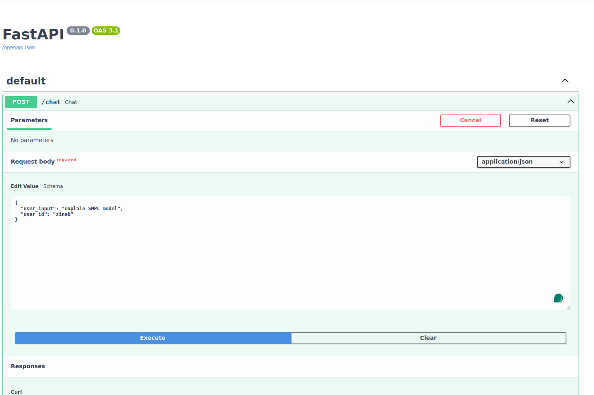
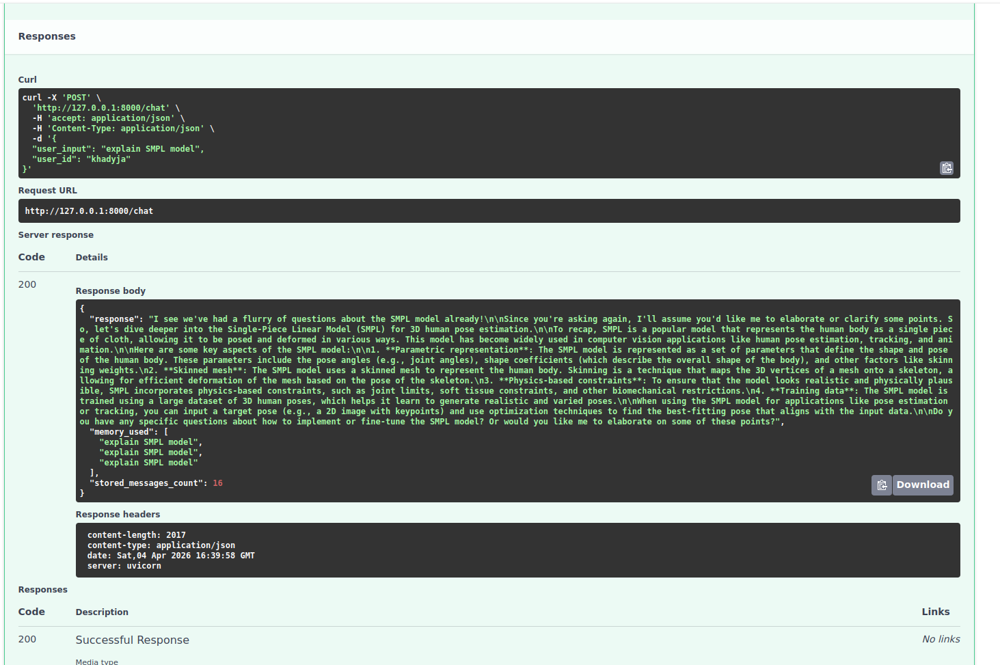

# OpenTutorAI-Enhanced

## 📌 Description

OpenTutorAI-Enhanced extends the OpenTutorAI platform by introducing an **adaptive avatar system** powered by conversational memory and AI.

The goal is to transform a static avatar into an **intelligent virtual tutor** capable of:
- remembering past interactions
- adapting its responses to the user
- generating context-aware explanations

The system integrates:
- **ChromaDB** for conversational memory
- **LLM (Llama3 via Ollama)** for response generation
- A **Retrieval-Augmented Generation (RAG)** approach to combine memory and reasoning

---

## 🤖 Objective

Enhance avatar intelligence by enabling:

- 🧠 Conversational memory  
- 👤 User-aware interaction  
- 🎯 Adaptive responses  
- 💬 Contextual dialogue generation  

---

## 🚀 Features

- Avatar-oriented conversational memory  
- Semantic search (top-k retrieval)  
- Multi-user support (user_id)  
- Persistent storage of user interactions  
- LLM-based response generation (Ollama - Llama3)  
- Context-aware and adaptive behavior  
- Foundation for expressive and personalized avatars  

---

## 🧠 Architecture

- **FastAPI** → API layer  
- **ChromaDB** → Vector memory storage  
- **LLM (Ollama)** → Intelligent response generation  
- **RAG** → Memory + reasoning fusion  
- **Avatar system (future integration)** → Behavior adaptation  

---

## ⚙️ Installation

### 1. Clone the repository

```bash
git clone https://github.com/your-username/OpenTutorAI-Enhanced.git
cd OpenTutorAI-Enhanced

2. Install dependencies

```bash
pip install -r requirements.txt

3. Run the API


`uvicorn main:app --reload`


4. Run LLM (Ollama)

`ollama run llama3`


🧪 Testing

Open Swagger UI:


Example request:




Example Behavior




The system:

Stores user messages in memory
Retrieves similar past interactions
Generates adaptive responses using LLM
Simulates an intelligent avatar capable of contextual dialogue


Future Work
Integration with 3D avatar generation pipeline (Reda project)
User preference modeling
Adaptive avatar behavior (tone, expressivity)
Emotion-aware responses
Real-time avatar animation based on dialogue

📁 Project Structure

main.py
services/
  ├── memory_service.py
  ├── llm_service.py
db/
  └── chroma_client.py
models/
  └── request_models.py